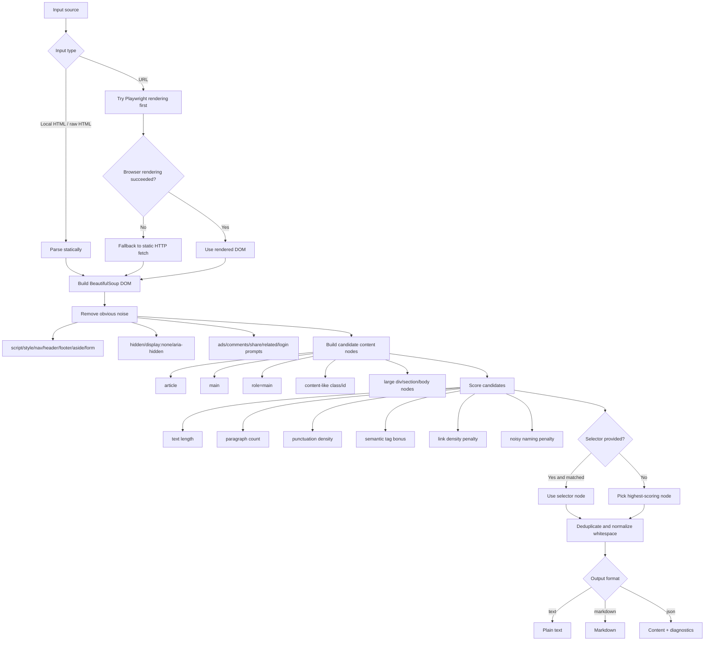

# Extract HTML Main


Extract readable main content from messy HTML, local files, and URLs.

## Overview

`Extract HTML Main` extracts readable main content from messy HTML pages.

In many web pages, the actual article body is only a small part of the DOM. The rest is often noise, such as navigation bars, ads, comments, related links, share widgets, login prompts, footers, and repeated layout templates.

If you pass full-page HTML directly into AI summarization, RAG pipelines, or agents, it often wastes tokens, lowers summary quality, pollutes retrieval results, and adds noise to downstream automation.

This tool aims to **keep the main content and remove as much noise as possible**.

## Use Cases

- Pre-cleaning pages before AI summarization
- Extracting article text for RAG ingestion
- Cleaning HTML after web scraping
- Converting saved pages to Markdown
- Preprocessing webpage content for AI agents

## Features

- Supports raw HTML, local HTML files, and URLs
- Supports Playwright / Chromium rendering for dynamic pages
- Falls back to static HTTP fetching when browser rendering is unavailable
- Supports manual CSS selectors
- Supports selector cache
- Supports `text` / `markdown` / `json` output
- Supports generating original-vs-extracted HTML comparison pages

## Installation

Minimal install:

```bash
bash install.sh
```

For dynamic pages, install browser rendering support:

```bash
bash install.sh --with-browser
```

## Quick Start

```bash
python3 scripts/extract_html_main.py examples/messy_article.html --format markdown
```

## Example 1: Extract main content from a local HTML file

```bash
python3 scripts/extract_html_main.py input.html --format markdown
```

What it does: reads a local HTML file, extracts the readable main content, and outputs cleaned Markdown.

## Example 2: Extract main content from a URL and output JSON

```bash
python3 scripts/extract_html_main.py https://example.com/article --format json
```

What it does: fetches a web page, extracts the readable article body, and returns content plus diagnostics.

If you already know the content container, you can also specify a selector:

```bash
python3 scripts/extract_html_main.py https://example.com/article --selector ".article-body" --format markdown
```

## Thought Process Flowchart

Here is the core extraction logic:



## Common Commands

Extract from local HTML:

```bash
python3 scripts/extract_html_main.py input.html --format markdown
```

Extract from URL:

```bash
python3 scripts/extract_html_main.py https://example.com/article --format markdown
```

Output JSON:

```bash
python3 scripts/extract_html_main.py https://example.com/article --format json
```

Write result to a file:

```bash
python3 scripts/extract_html_main.py input.html --format markdown --output body.md
```

Generate comparison page:

```bash
python3 scripts/make_html_compare.py input.html \
  --selector ".article-body" \
  --output compare.html
```

## Main Files

- `SKILL.md`: Codex skill instructions and workflow
- `scripts/extract_html_main.py`: main extraction CLI
- `scripts/make_html_compare.py`: comparison page generator
- `scripts/smoke_test.sh`: local smoke test
- `examples/`: sample HTML files
- `references/heuristics.md`: scoring and cleanup rules
- `docs/RELEASE_CHECKLIST.md`: pre-release checklist

## Development Check

```bash
bash scripts/smoke_test.sh
```

Or run manually:

```bash
python3 -m py_compile scripts/extract_html_main.py scripts/make_html_compare.py
python3 scripts/extract_html_main.py examples/messy_article.html --format markdown
```

## License

MIT License. See `LICENSE`.
