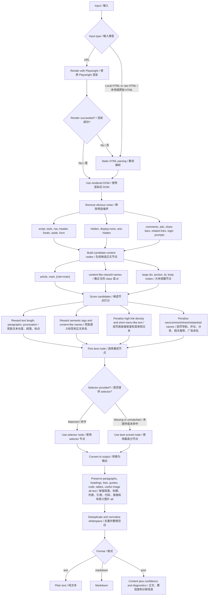

# Extract HTML Main / 网页正文提取

Utilities and Codex skill instructions for extracting the readable main body from messy HTML pages, saved browser pages, and URLs.

用于从杂乱 HTML、保存网页和 URL 中提取可阅读正文的 Codex skill 与配套工具。

The extractor treats main content as the text a reader came for. It removes navigation, sidebars, ads, comments, share widgets, empty layout nodes, and other page chrome before returning plain text, Markdown, or JSON diagnostics.

本工具把“正文”理解为读者真正要看的内容。它会尽量剔除导航、侧边栏、广告、评论、分享组件、空布局节点和页面外壳，再输出纯文本、Markdown 或 JSON 诊断结果。

## What It Does / 功能

- Extracts article/body content from raw HTML, local files, and URLs.
- 从 raw HTML、本地文件和 URL 中提取文章/正文内容。
- Uses Playwright/Chromium first for URLs, then falls back to static HTTP fetching.
- URL 默认优先使用 Playwright/Chromium 渲染，失败后自动退回静态 HTTP 抓取。
- Supports manual CSS selectors when a site has a known content container.
- 支持手动指定 CSS selector，适合正文容器已知的网站。
- Caches reusable selectors by domain or path.
- 支持按域名或路径缓存可复用 selector。
- Provides a Chrome DevTools helper and optional extension for picking selectors.
- 提供 Chrome DevTools 辅助脚本和可选 Chrome 扩展，用于人工选择正文容器。
- Generates browser-openable comparison pages for original HTML vs extracted HTML.
- 可生成浏览器可打开的“原 HTML vs 提取正文 HTML”对比页。

## Requirements / 依赖

Minimum / 最小依赖：

```bash
python3 -m pip install beautifulsoup4
```

Recommended for dynamic pages / 动态页面推荐安装：

```bash
python3 -m pip install playwright
python3 -m playwright install chromium
```

If Playwright or Chromium is unavailable, URL extraction automatically falls back to static HTTP fetching.

如果 Playwright 或 Chromium 不可用，URL 抽取会自动退回静态 HTTP 抓取。

## How It Works / 工作原理

The extractor first loads the most complete DOM it can get, then scores likely content containers and cleans the winning node before output.

工具会先尽量获取完整 DOM，然后给可能的正文容器打分，选出最佳节点，清理噪声后再输出。



## Quick Start / 快速开始

Extract Markdown from a local HTML file / 从本地 HTML 提取 Markdown：

```bash
python3 scripts/extract_html_main.py input.html --format markdown
```

Extract JSON diagnostics from a URL. URLs render through Playwright by default when available.

从 URL 提取 JSON 诊断信息。URL 默认在可用时通过 Playwright 渲染：

```bash
python3 scripts/extract_html_main.py https://example.com/article --format json
```

Force static URL fetching / 强制使用静态 URL 抓取：

```bash
python3 scripts/extract_html_main.py https://example.com/article --no-browser --format markdown
```

Use a known正文 selector / 使用已知正文 selector：

```bash
python3 scripts/extract_html_main.py input.html --selector ".article-body" --format markdown
```

Write output to a file / 写入输出文件：

```bash
python3 scripts/extract_html_main.py input.html --format markdown --output body.md
```

## Selector Cache / Selector 缓存

The default selector cache is / 默认 selector 缓存路径：

```text
~/.codex/html_main_selectors.json
```

Save a selector for a URL path / 为 URL 路径保存 selector：

```bash
python3 scripts/extract_html_main.py "https://example.com/news/123" \
  --selector ".article-body" \
  --save-selector \
  --format markdown
```

Save a domain-level class selector for repeated pages from the same site.

为同站点批量页面保存域名级 class selector：

```bash
python3 scripts/extract_html_main.py "https://example.com/news/123" \
  --selector ".article-body" \
  --save-domain-class \
  --format markdown
```

On later pages from the same domain, omit `--selector`; the script will use the cached rule when it matches.

之后处理同域名页面时可以省略 `--selector`；命中缓存规则后脚本会自动使用。

## Manual Selector Picking / 手动选择 Selector

For manual selection in Chrome DevTools / 在 Chrome DevTools 中手动选择：

1. Open the page. / 打开页面。
2. Paste `scripts/pick_main_selector.js` into the Console. / 把 `scripts/pick_main_selector.js` 粘贴到 Console。
3. Click the outermost正文 node. / 点击正文最外层节点。
4. Use the generated selector with `--selector`. / 将生成的 selector 用于 `--selector`。

The repository also includes a small Chrome extension in `selector_picker_extension/`. Start the receiver first:

仓库也包含一个小型 Chrome 扩展，位于 `selector_picker_extension/`。先启动本地 receiver：

```bash
python3 selector_receiver.py
```

Then load `selector_picker_extension/` as an unpacked extension in Chrome. Right-click the正文 area and choose "保存为正文 selector" to save the rule locally.

然后在 Chrome 中以 unpacked extension 方式加载 `selector_picker_extension/`。在正文区域右键选择“保存为正文 selector”，即可把规则保存到本地。

## Compare Original And Extracted HTML / 对比原 HTML 和正文 HTML

Generate a browser-openable comparison page / 生成浏览器可打开的对比页：

```bash
python3 scripts/make_html_compare.py input.html \
  --selector ".article-body" \
  --output compare.html
```

Open `compare.html` in Chrome. The left pane shows the original HTML, and the right pane shows the cleaned正文 HTML.

用 Chrome 打开 `compare.html`。左侧显示原始 HTML，右侧显示清理后的正文 HTML。

## Main Files / 主要文件

- `SKILL.md`: Codex skill instructions and workflow. / Codex skill 指令和工作流。
- `scripts/extract_html_main.py`: Main extraction CLI. / 主提取命令行工具。
- `scripts/make_html_compare.py`: Original-vs-extracted HTML comparison page generator. / 原 HTML 与正文 HTML 对比页生成器。
- `scripts/pick_main_selector.js`: DevTools selector picker. / DevTools selector 选择脚本。
- `selector_receiver.py`: Local selector cache receiver for the Chrome extension. / Chrome 扩展使用的本地 selector 缓存接收器。
- `selector_picker_extension/`: Chrome context-menu selector picker. / Chrome 右键菜单 selector 选择扩展。
- `references/heuristics.md`: Candidate scoring and cleanup rules. / 候选节点评分与清理规则。

## Development Checks / 开发检查

Run a syntax check / 运行语法检查：

```bash
python3 -m py_compile scripts/extract_html_main.py selector_receiver.py scripts/make_html_compare.py
```

Run a tiny extraction smoke test / 运行一个最小抽取冒烟测试：

```bash
python3 scripts/extract_html_main.py '<html><body><nav>Home</nav><article><p>Main text, with punctuation.</p></article></body></html>' --format markdown
```
