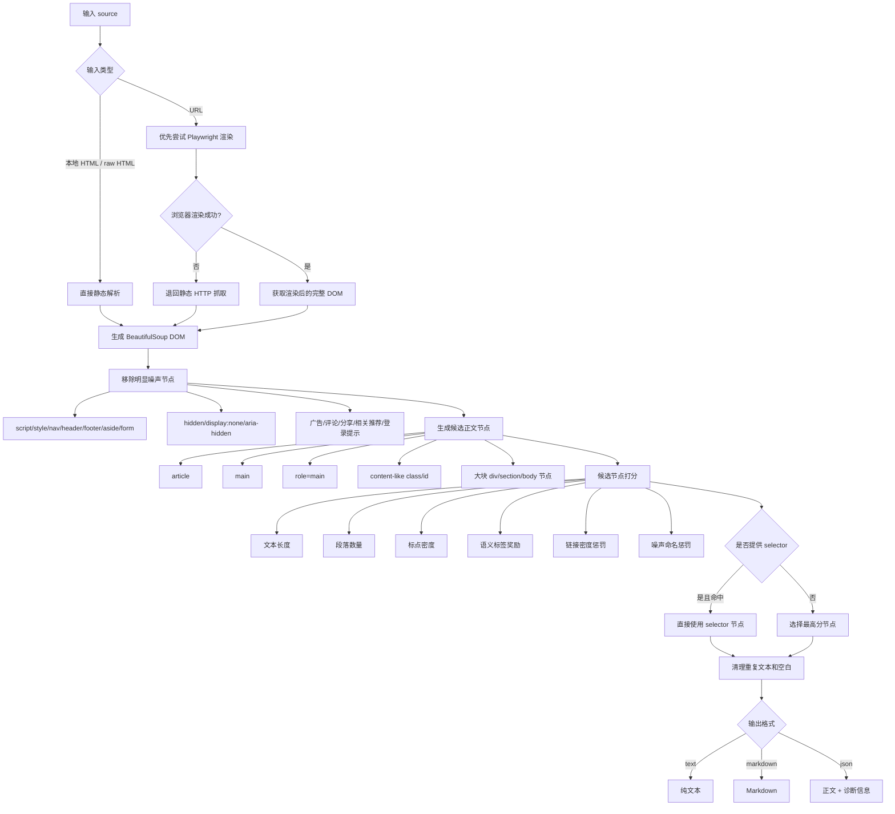
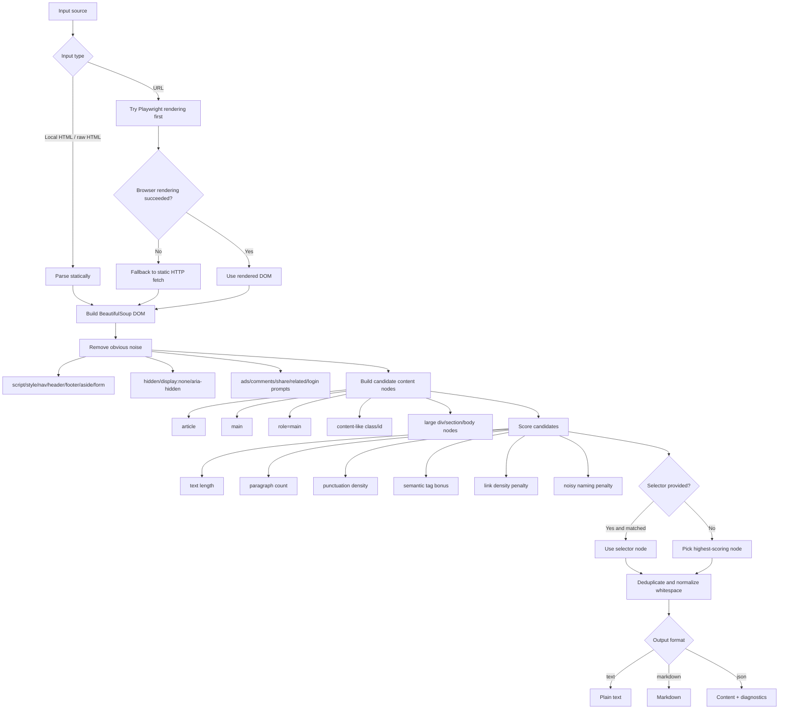

# Extract HTML Main


Extract readable main content from messy HTML, local files, and URLs.

一个用于从杂乱 HTML、本地网页文件和 URL 中提取正文内容的工具，适合 AI 摘要、RAG、网页清洗和 Agent 数据预处理。

---

## 中文

### 项目简介

`Extract HTML Main` 用来从杂乱网页中提取真正的正文内容。

很多网页里，真正有价值的信息只占一小部分，剩下大量内容往往是导航栏、广告、评论区、相关推荐、分享按钮、登录提示、Footer 和各种页面模板噪声。

如果直接把整页 HTML 丢给 AI 摘要、RAG 或 Agent，通常会浪费 token、降低摘要质量、污染检索结果，并干扰后续自动化处理。

这个工具的目标就是：**尽量只保留正文，尽量去掉噪声。**

### 适用场景

- AI 摘要前的数据清洗
- RAG 知识库网页正文提取
- 爬虫采集后的正文清洗
- 批量网页转 Markdown
- AI Agent 处理网页内容前的预处理

### 功能特性

- 支持 raw HTML、本地 HTML 文件、URL
- 支持 Playwright / Chromium 动态页面渲染
- 浏览器不可用时自动退回静态 HTTP 抓取
- 支持手动指定 CSS selector
- 支持 selector 缓存
- 支持输出 `text` / `markdown` / `json`
- 支持生成原 HTML 和提取结果的对比页

### 安装

最小安装：

```bash
bash install.sh
```

如果你要处理动态网页，推荐安装浏览器渲染能力：

```bash
bash install.sh --with-browser
```

### 快速开始

```bash
python3 scripts/extract_html_main.py examples/messy_article.html --format markdown
```

### 示例 1：从本地 HTML 提取正文

```bash
python3 scripts/extract_html_main.py input.html --format markdown
```

作用：输入一个本地 HTML 文件，输出清洗后的 Markdown 正文。

### 示例 2：从 URL 提取正文并输出 JSON

```bash
python3 scripts/extract_html_main.py https://example.com/article --format json
```

作用：从网页地址提取正文，输出正文内容和诊断信息，适合调试或接入自动化流程。

如果你已经知道正文容器，也可以手动指定 selector：

```bash
python3 scripts/extract_html_main.py https://example.com/article --selector ".article-body" --format markdown
```

### 思维流程图

下面是正文提取的核心思路流程图：



### 常用命令

提取本地 HTML：

```bash
python3 scripts/extract_html_main.py input.html --format markdown
```

提取 URL：

```bash
python3 scripts/extract_html_main.py https://example.com/article --format markdown
```

输出 JSON：

```bash
python3 scripts/extract_html_main.py https://example.com/article --format json
```

写入文件：

```bash
python3 scripts/extract_html_main.py input.html --format markdown --output body.md
```

生成对比页：

```bash
python3 scripts/make_html_compare.py input.html \
  --selector ".article-body" \
  --output compare.html
```

### 主要文件

- `SKILL.md`：Codex skill 指令和工作流
- `scripts/extract_html_main.py`：正文提取主程序
- `scripts/make_html_compare.py`：原 HTML 与提取结果对比页生成器
- `scripts/smoke_test.sh`：本地冒烟测试
- `examples/`：示例 HTML
- `references/heuristics.md`：候选节点评分与清理规则
- `docs/RELEASE_CHECKLIST.md`：发布前检查清单

### 开发检查

```bash
bash scripts/smoke_test.sh
```

或手动运行：

```bash
python3 -m py_compile scripts/extract_html_main.py scripts/make_html_compare.py
python3 scripts/extract_html_main.py examples/messy_article.html --format markdown
```

---

## English

### Overview

`Extract HTML Main` extracts readable main content from messy HTML pages.

In many web pages, the actual article body is only a small part of the DOM. The rest is often noise, such as navigation bars, ads, comments, related links, share widgets, login prompts, footers, and repeated layout templates.

If you pass full-page HTML directly into AI summarization, RAG pipelines, or agents, it often wastes tokens, lowers summary quality, pollutes retrieval results, and adds noise to downstream automation.

This tool aims to **keep the main content and remove as much noise as possible**.

### Use Cases

- Pre-cleaning pages before AI summarization
- Extracting article text for RAG ingestion
- Cleaning HTML after web scraping
- Converting saved pages to Markdown
- Preprocessing webpage content for AI agents

### Features

- Supports raw HTML, local HTML files, and URLs
- Supports Playwright / Chromium rendering for dynamic pages
- Falls back to static HTTP fetching when browser rendering is unavailable
- Supports manual CSS selectors
- Supports selector cache
- Supports `text` / `markdown` / `json` output
- Supports generating original-vs-extracted HTML comparison pages

### Installation

Minimal install:

```bash
bash install.sh
```

For dynamic pages, install browser rendering support:

```bash
bash install.sh --with-browser
```

### Quick Start

```bash
python3 scripts/extract_html_main.py examples/messy_article.html --format markdown
```

### Example 1: Extract main content from a local HTML file

```bash
python3 scripts/extract_html_main.py input.html --format markdown
```

What it does: reads a local HTML file, extracts the readable main content, and outputs cleaned Markdown.

### Example 2: Extract main content from a URL and output JSON

```bash
python3 scripts/extract_html_main.py https://example.com/article --format json
```

What it does: fetches a web page, extracts the readable article body, and returns content plus diagnostics.

If you already know the content container, you can also specify a selector:

```bash
python3 scripts/extract_html_main.py https://example.com/article --selector ".article-body" --format markdown
```

### Thought Process Flowchart

Here is the core extraction logic:



### Common Commands

Extract from local HTML:

```bash
python3 scripts/extract_html_main.py input.html --format markdown
```

Extract from URL:

```bash
python3 scripts/extract_html_main.py https://example.com/article --format markdown
```

Output JSON:

```bash
python3 scripts/extract_html_main.py https://example.com/article --format json
```

Write result to a file:

```bash
python3 scripts/extract_html_main.py input.html --format markdown --output body.md
```

Generate comparison page:

```bash
python3 scripts/make_html_compare.py input.html \
  --selector ".article-body" \
  --output compare.html
```

### Main Files

- `SKILL.md`: Codex skill instructions and workflow
- `scripts/extract_html_main.py`: main extraction CLI
- `scripts/make_html_compare.py`: comparison page generator
- `scripts/smoke_test.sh`: local smoke test
- `examples/`: sample HTML files
- `references/heuristics.md`: scoring and cleanup rules
- `docs/RELEASE_CHECKLIST.md`: pre-release checklist

### Development Check

```bash
bash scripts/smoke_test.sh
```

Or run manually:

```bash
python3 -m py_compile scripts/extract_html_main.py scripts/make_html_compare.py
python3 scripts/extract_html_main.py examples/messy_article.html --format markdown
```

## License

MIT License. See `LICENSE`.
