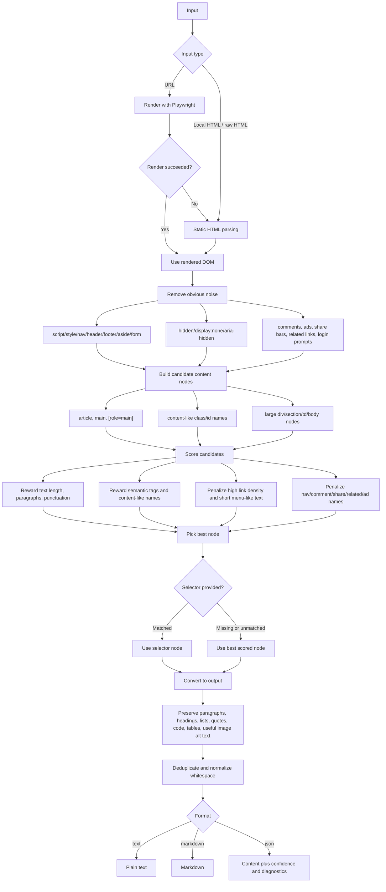

# Extract HTML Main

Utilities and Codex skill instructions for extracting the readable main body from messy HTML pages, saved browser pages, and URLs.

The extractor treats main content as the text a reader came for. It removes navigation, sidebars, ads, comments, share widgets, empty layout nodes, and other page chrome before returning plain text, Markdown, or JSON diagnostics.

## What It Does

- Extracts article/body content from raw HTML, local files, and URLs.
- Uses Playwright/Chromium first for URLs, then falls back to static HTTP fetching.
- Supports manual CSS selectors when a site has a known content container.
- Caches reusable selectors by domain or path.
- Provides a Chrome DevTools helper and optional extension for picking selectors.
- Generates browser-openable comparison pages for original HTML vs extracted HTML.

## Requirements

Minimum:

```bash
python3 -m pip install beautifulsoup4
```

Recommended for dynamic pages:

```bash
python3 -m pip install playwright
python3 -m playwright install chromium
```

If Playwright or Chromium is unavailable, URL extraction automatically falls back to static HTTP fetching.

## How It Works

The extractor first loads the most complete DOM it can get, then scores likely content containers and cleans the winning node before output.



## Quick Start

Extract Markdown from a local HTML file:

```bash
python3 scripts/extract_html_main.py input.html --format markdown
```

Extract JSON diagnostics from a URL. URLs render through Playwright by default when available:

```bash
python3 scripts/extract_html_main.py https://example.com/article --format json
```

Force static URL fetching:

```bash
python3 scripts/extract_html_main.py https://example.com/article --no-browser --format markdown
```

Use a known正文 selector:

```bash
python3 scripts/extract_html_main.py input.html --selector ".article-body" --format markdown
```

Write output to a file:

```bash
python3 scripts/extract_html_main.py input.html --format markdown --output body.md
```

## Selector Cache

The default selector cache is:

```text
~/.codex/html_main_selectors.json
```

Save a selector for a URL path:

```bash
python3 scripts/extract_html_main.py "https://example.com/news/123" \
  --selector ".article-body" \
  --save-selector \
  --format markdown
```

Save a domain-level class selector for repeated pages from the same site:

```bash
python3 scripts/extract_html_main.py "https://example.com/news/123" \
  --selector ".article-body" \
  --save-domain-class \
  --format markdown
```

On later pages from the same domain, omit `--selector`; the script will use the cached rule when it matches.

## Manual Selector Picking

For manual selection in Chrome DevTools:

1. Open the page.
2. Paste `scripts/pick_main_selector.js` into the Console.
3. Click the outermost正文 node.
4. Use the generated selector with `--selector`.

The repository also includes a small Chrome extension in `selector_picker_extension/`. Start the receiver first:

```bash
python3 selector_receiver.py
```

Then load `selector_picker_extension/` as an unpacked extension in Chrome. Right-click the正文 area and choose "保存为正文 selector" to save the rule locally.

## Compare Original And Extracted HTML

Generate a browser-openable comparison page:

```bash
python3 scripts/make_html_compare.py input.html \
  --selector ".article-body" \
  --output compare.html
```

Open `compare.html` in Chrome. The left pane shows the original HTML, and the right pane shows the cleaned正文 HTML.

## Main Files

- `SKILL.md`: Codex skill instructions and workflow.
- `scripts/extract_html_main.py`: Main extraction CLI.
- `scripts/make_html_compare.py`: Original-vs-extracted HTML comparison page generator.
- `scripts/pick_main_selector.js`: DevTools selector picker.
- `selector_receiver.py`: Local selector cache receiver for the Chrome extension.
- `selector_picker_extension/`: Chrome context-menu selector picker.
- `references/heuristics.md`: Candidate scoring and cleanup rules.

## Development Checks

Run a syntax check:

```bash
python3 -m py_compile scripts/extract_html_main.py selector_receiver.py scripts/make_html_compare.py
```

Run a tiny extraction smoke test:

```bash
python3 scripts/extract_html_main.py '<html><body><nav>Home</nav><article><p>Main text, with punctuation.</p></article></body></html>' --format markdown
```
