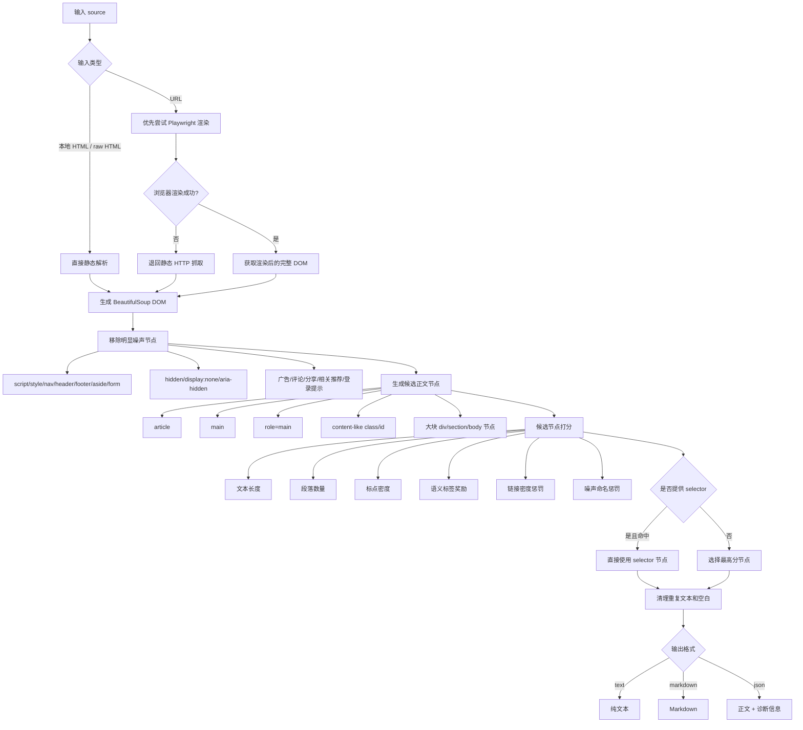

# Extract HTML Main


一个用于从杂乱 HTML、本地网页文件和 URL 中提取正文内容的工具，适合 AI 摘要、RAG、网页清洗和 Agent 数据预处理。

## 项目简介

`Extract HTML Main` 用来从杂乱网页中提取真正的正文内容。

很多网页里，真正有价值的信息只占一小部分，剩下大量内容往往是导航栏、广告、评论区、相关推荐、分享按钮、登录提示、Footer 和各种页面模板噪声。

如果直接把整页 HTML 丢给 AI 摘要、RAG 或 Agent，通常会浪费 token、降低摘要质量、污染检索结果，并干扰后续自动化处理。

这个工具的目标就是：**尽量只保留正文，尽量去掉噪声。**

## 适用场景

- AI 摘要前的数据清洗
- RAG 知识库网页正文提取
- 爬虫采集后的正文清洗
- 批量网页转 Markdown
- AI Agent 处理网页内容前的预处理

## 功能特性

- 支持 raw HTML、本地 HTML 文件、URL
- 支持 Playwright / Chromium 动态页面渲染
- 浏览器不可用时自动退回静态 HTTP 抓取
- 支持手动指定 CSS selector
- 支持 selector 缓存
- 支持输出 `text` / `markdown` / `json`
- 支持生成原 HTML 和提取结果的对比页

## 安装

最小安装：

```bash
bash install.sh
```

如果你要处理动态网页，推荐安装浏览器渲染能力：

```bash
bash install.sh --with-browser
```

## 快速开始

```bash
python3 scripts/extract_html_main.py examples/messy_article.html --format markdown
```

## 示例 1：从本地 HTML 提取正文

```bash
python3 scripts/extract_html_main.py input.html --format markdown
```

作用：输入一个本地 HTML 文件，输出清洗后的 Markdown 正文。

## 示例 2：从 URL 提取正文并输出 JSON

```bash
python3 scripts/extract_html_main.py https://example.com/article --format json
```

作用：从网页地址提取正文，输出正文内容和诊断信息，适合调试或接入自动化流程。

如果你已经知道正文容器，也可以手动指定 selector：

```bash
python3 scripts/extract_html_main.py https://example.com/article --selector ".article-body" --format markdown
```

## 思维流程图

下面是正文提取的核心思路流程图：



## 常用命令

提取本地 HTML：

```bash
python3 scripts/extract_html_main.py input.html --format markdown
```

提取 URL：

```bash
python3 scripts/extract_html_main.py https://example.com/article --format markdown
```

输出 JSON：

```bash
python3 scripts/extract_html_main.py https://example.com/article --format json
```

写入文件：

```bash
python3 scripts/extract_html_main.py input.html --format markdown --output body.md
```

生成对比页：

```bash
python3 scripts/make_html_compare.py input.html \
  --selector ".article-body" \
  --output compare.html
```

## 主要文件

- `SKILL.md`：Codex skill 指令和工作流
- `scripts/extract_html_main.py`：正文提取主程序
- `scripts/make_html_compare.py`：原 HTML 与提取结果对比页生成器
- `scripts/smoke_test.sh`：本地冒烟测试
- `examples/`：示例 HTML
- `references/heuristics.md`：候选节点评分与清理规则
- `docs/RELEASE_CHECKLIST.md`：发布前检查清单

## 开发检查

```bash
bash scripts/smoke_test.sh
```

或手动运行：

```bash
python3 -m py_compile scripts/extract_html_main.py scripts/make_html_compare.py
python3 scripts/extract_html_main.py examples/messy_article.html --format markdown
```

## 许可证

MIT License，见 `LICENSE`。
